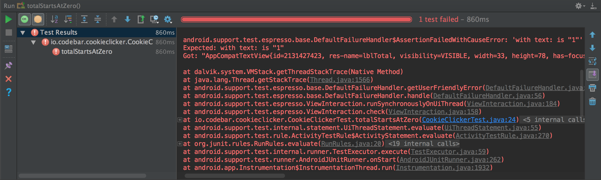

## Introduction
This tutorial follows on from the [first one where you built a cookie clicker]({{ site.baseurl }}/worksheets/1-introduction/). If you worked on that tutorial already, follow along using the code you wrote previously.

If you didn't work on that tutorial, or you don't have the code anymore, you can download a completed project to follow along with [here](downloads/cookie-clicker.zip). Download the file, unzip it and then open it with Android Studio using the *Open an exisiting Android Studio project* button on the welcome screen.

## What is UI testing?
To make sure you software works properly you need to test it whenever you make a change that you want to release to your users. For something like an app you need to go through all the features of the app and make sure that nothing is broken. For even a small app this is a boring, repetative, and time consuming job. That's exactly the sort of thing which we use computers for! Automated tests are pieces of code which test that your software is working correctly for you.

We are going to write some UI tests for our cookie clicker app. A UI test is also known as a "funcational test" as it is testing the functionality of the app. There are other types of tests such as "unit tests" which you may have come across in the Javascript, Ruby, or Python tutorials.

A UI test will take a set of instrutions about what to click on and checks that the application responds correctly. They are doing the same as if you were clicking on and testing the app manually, but they can do it much quicker and they don't get bored when they have to do it for the 100th time!

First, we need to set up our testing framework.

## Setting up Espresso
We are going to be using a testing framework called [Espresso](https://google.github.io/android-testing-support-library/docs/espresso/index.html) to interact with our app and test that it is working correctly. This is a tool provided by Google themselves.

First, we need to make sure the libraries are installed correctly.

In Android Studio, expand the `Gradle Scripts` section at the bottom of the project explorer on the left. Then double click to open the `bundle.gradle (Module: app)` file. Make sure it's the `Module: app` one and not the `Project: CookieClicker` one. This is the file which describes how to build and run our Android application. We need to make sure everything is set up correctly here to let us use Espresso.

Inside the `dependencies` section, make sure that these two blocks of code are there:

```groovy
androidTestCompile('com.android.support.test.espresso:espresso-core:2.2.2', {
    exclude group: 'com.android.support', module: 'support-annotations'
})
```

And:

```groovy
testCompile 'junit:junit:4.12'
```

They might already be there depending on how you created your project. If they aren't, add them in. These lines tell the Android build system which version of the Espresso library to use.

Also, make sure that this line in the your `android.defaultConfig` section:

```groovy
testInstrumentationRunner "android.support.test.runner.AndroidJUnitRunner"
```

The complete file should look something like this (don't worry if yours has some extra bits:

```groovy
apply plugin: 'com.android.application'

android {
    compileSdkVersion 25
    buildToolsVersion "25.0.2"
    defaultConfig {
        applicationId "io.codebar.cookieclicker"
        minSdkVersion 14
        targetSdkVersion 25
        versionCode 1
        versionName "1.0"
        testInstrumentationRunner "android.support.test.runner.AndroidJUnitRunner"
    }
}

dependencies {
    compile fileTree(dir: 'libs', include: ['*.jar'])
    compile 'com.android.support:appcompat-v7:25.3.1'
    compile 'com.android.support.constraint:constraint-layout:1.0.2'

    testCompile 'junit:junit:4.12'
    androidTestCompile('com.android.support.test.espresso:espresso-core:2.2.2', {
        exclude group: 'com.android.support', module: 'support-annotations'
    })
}
```

Press the *Sync Now* button in the bar which has appears along the top. If the bar disappears after syncing then everything is set up correctly! If the bar shows and error message and a *Try Again* button then something has gone wrong. Take a look at the error at the bottom of the screen to see if you can fix it, or ask your coach for help.

## Writing our first test
Now we have everything set up, we can write our first test!

In the project navigator on the left panel of Android Studio, navigate through `app -> java -> <package name> (androidTest)` where `<package name>` is the name you used when you set up the project. Right click on the `(androidTest)` line and choose `New -> Java Class`. In the window which pops up, give it a name of `CookieClickerTest` and then press `OK`. This will create and open a file which looks like this:

```java
package io.codebar.cookieclicker;

public class CookieClickerTest {
}
```

Above the `public class` line, add in this line:

```java
@RunWith(AndroidJUnit4.class)
```

Remember to use the autocomplete as much as possible as it will also add in some `import` lines above for you. This line tells Android how to run the tests are are about to write.

Inside the `class` add the following line:

```java
@Rule
public ActivityTestRule<MainActivity> activityTestRule = new ActivityTestRule<>(MainActivity.class);
```

This is a "test rule" and test Espresso which activity (part of our app) we want to test. We have chosen the `MainActivity`. This rule will make Espresso open this activity before running our test so we can see the cookie clicker and test it is working.

We now need to actually write some test code. Inside the `class`, create a new method called `totalStartsAtZero`. It should look like this:

```java
@Test
public void totalStartsAtZero() throws Exception {

}
```

We will be writing one of these methods for each test that we want to perform. As you can guess from the name, we are first going to check that the counter starts off at zero.

Inside the method, write the following code:

```java
onView(withId(R.id.lblTotal))
    .check(matches(withText("0")));
```

So what are we doing here? The first line (`onView`) is finding the view which matches the requirements we have given to it. We have asked for the view with the id of `lblTotal` using `withId(R.id.lblTotal)`. Remember that this is the id we gave to our `TextView` in the first tutorial in the `activity_main.xml` layout file. The second line is checking that the view matches some condictions. We are checking that the view has the text `"0"` using `withText("0")`.

This pattern of getting the view with a set of requirements and then checking something with it forms the basis of how Expresso tests work.

The completed test file should now look like this:

```java
package io.codebar.cookieclicker;

import android.support.test.rule.ActivityTestRule;
import android.support.test.runner.AndroidJUnit4;

import org.junit.Rule;
import org.junit.Test;
import org.junit.runner.RunWith;

import static android.support.test.espresso.Espresso.onView;
import static android.support.test.espresso.assertion.ViewAssertions.matches;
import static android.support.test.espresso.matcher.ViewMatchers.withId;
import static android.support.test.espresso.matcher.ViewMatchers.withText;

@RunWith(AndroidJUnit4.class)
public class CookieClickerTest {
    @Rule
    public ActivityTestRule<MainActivity> activityTestRule = new ActivityTestRule<>(MainActivity.class);

    @Test
    public void totalStartsAtZero() throws Exception {
        onView(withId(R.id.lblTotal))
                .check(matches(withText("0")));
    }
}

```

Let run our test to make sure the app is working correctly. Press the "play" button to the left of the method and pick your Android device or emulator to run the tests on. This might take a short amount of time but the app should appear and the quickly disappear and Android Studio should show a "Tests passed" message. This might even be too quick to see and that's the advantage of using automated tests! Run it a few time if you want to test it is working all the time.


Just to see what happens when a test fails, change the check to look for `"1"` and run the test again. You should see an error message saying what happened and some hints on how to fix it. There's a lot of information there, but there's normally enough to know what went wrong.



Change you test back to check for `"0"` so that it passes again.

## Tapping on the cookie
We should now do something a little more interesting with our tests. We are going to test that pressing on the cookie increases our total counter.

Create a new method called `totalIncreasesWhenCookieClicked`. Inside this method add the following code:

```java
onView(withId(R.id.imgCookie))
        .perform(click());
```

This looks similar to the code before, except this time we are performing an action rather than checking something. The first line finds the view with the id `imgCookie` (take a look at your `activity-main.xml` file if you can't remember which view this was). The second line then performs a click action on it. This will call our `OnClickListener` in our `MainActivity.java` file and should update the total label. We now need to write a check for that.

To do this, add in these lines to the new test method:

```java
onView(withId(R.id.lblTotal))
        .check(matches(withText("1")));
```

This is almost exactly the same as the code we wrote for our `totalStartsAtZero` test, but we're instead checking to see that it is now `"1"`.

Our completed test should now look like this:

```java
@Test
public void totalIncreasesWhenCookieClicked() throws Exception {
    onView(withId(R.id.imgCookie))
            .perform(click());

    onView(withId(R.id.lblTotal))
            .check(matches(withText("1")));
}
```

Let's run this new test using the play icon next to the `totalIncreasesWhenCookieClicked` method line. This test should take just long enough for you to see the 1 on the screen, but it's still so fast that you might blink and miss it!

## Getting a high score!
We've now tested all the functionality of our app, so now let's do something just for fun: let's make Espresso click loads of time on the cookie and get a high score!

Create a new method called `achieveHighScore`. Copy the code the click test you just wrote and wrap the code to click the cookie image in a for loop from 0 to 100. You then need to check that the total counter has reached `"100"` after the for loop has completed. As your coach if you're not sure how to do this, or take a peak at the code below:

```java
@Test
public void achieveHighScore() throws Exception {
    for (int i = 0; i < 100; i++) {
        onView(withId(R.id.imgCookie))
                .perform(click());
    }

    onView(withId(R.id.lblTotal))
            .check(matches(withText("100")));
}
```

If you run this test it should take long enough that you can see what's going on.

As well as running the tests one by one, you can run all your apps tests by pressing on the "double play" icon next to the `public class CookieClickerTest` line. This will run all the tests in this file one by one and let you know which ones pass and fail.


## Further information
You have now tested your cookie clicker app!

You can read more about Android testing using the links below:

* [Espresso documentation](https://google.github.io/android-testing-support-library/docs/espresso/index.html).
* [Android testing documentation](https://developer.android.com/studio/test/index.html).
* [Using the Espresso test recorder](https://developer.android.com/studio/test/espresso-test-recorder.html).
